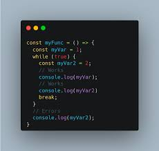

### In JavaScript we have two types of "Table Of Contents"

# 1. Scope
# 2. Hoisting

## 1. Scope
## In JavaScript we have four kinds of scope

### 1.Global Scope
### 2.Function Scope
### 3.Block Scope
### 4.Module Scope

## 1.Global Scope

### We should write Global Scope out of any Loops, Function or Array

## 2.Function Scope
.png)
### In Function Scope we should write the variables inside the function NOT outside.

## 3.Block Scope

### In Block Scope also we should write the variables inside the Condition or Loop but there is a RULE: if we write the variables with let and const we get an Error that called "ReferenceError" and this Error is called TDZ problem. Only with variable var we shouldn't get any error.

## 2.Hoisting

### This is the Reason of Hoisting
## To summarise, it appears there are two key benefits of Hoisting: Allow you to use function declarations before they are defined. This allows you to organise where you put your function code regardless of where they are called as long as they are within the same scope. Improve the performance of the interpreter.